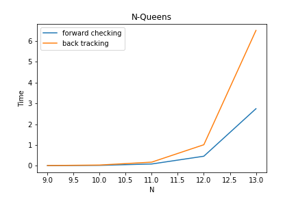
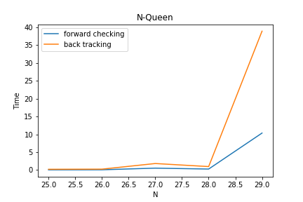

# AI-CSP

## 算法原理

### Constraint Satisfaction Problem (CSP)

CSP问题被定义为$(X, D, C)$，其中：

$$X = \lbrace x_1,x_2,\ldots,x_n\rbrace$$

$$D = \lbrace d_i:i\in [1,n]\rbrace$$

$$C = \lbrace c_1, c_2, \ldots, c_m\rbrace$$

$X$表示$n$变量的集合，$D$表示每个变量的取值范围，$C$表示$m$个约束条件。

CSP问题的一个解是指：找到一组$(x_1, x_2, \ldots, x_n)$的取值满足$C$。

### Backtracking

回溯算法本质上是一种**暴力穷举**的算法。

通过不断的给未赋值变量赋值，来构造解，在过程中不断检查赋值是否满足约束$C$。算法流程如下：

1. 选择一个未赋值变量$x_i$
2. 选择$v\in d_i$，然后$x_i \leftarrow v$
3. 检查此时所有已经赋值的$x$是否满足$C$，不满足则回溯，满足则重复步骤1

### Forward Checking

FC算法本质上实在回溯算法的基础上加入了constraint propagation（约束传播）。

在每次为变量$x_i $赋值后，根据所有与$x_i$相关的约束，对其他变量的取值范围进行限制。

举个例子：$x_1,x_2$被$c_1(x_1,x_2)$约束，当为$x_1$赋值后，$x_2$的取值范围将发生改变。

## 伪代码与流程图

### Backtracking

```pseudocode
Function backTracking(x)
	For each v in d[x]
		assign[x] <- v
		If check(X, C)
			find an unassigned variable y
			If y is NULL
				print assign
				RETURN
			Else
				backTracking(y)
			End
		End
	End
End
```


### Forward Checking

```pseudocode
Function FC(x)
	For each v in d[x]
		assign[x] <- v
		constrainPropagation(x, v)
		find an unassigned variable y
		If y is NULL
			print assign
			RETURN
		Else
			FC(y)
		End
	End
End
```


## 代码展示

### Backtracking

* cpp

  ```c++
  const int MAXN = 50; 
  
  int N; 
  int state[MAXN];
  
  bool check(int n, int a) {
  	for (int i = 0; i < n; ++i) {
  		if (state[i] == a || 
  			state[i] == a + n - i || 
  			state[i] == a - n + i)
  			return false;
  	}
  	return true;
  }
  
  int dfs_backtracking(int n) {
  	if (n >= N) {
  		return 1;
  	}
  	int ret = 0;
  	for (int i = 0; i < N; ++i) if (check(n, i)) {
  		state[n] = i;
  		ret += dfs_backtracking(n + 1);
  	}
  	return ret;
  }
  
  
  int nQueens2(int n) {
  	N = n;
  	return dfs_backtracking(0);
  }
  ```

* python

  ```python
  def check_backtracking(n, a):
      global state
      for i in range(n):
          if a == state[i] or a + n - i == state[i] or a - n + i == state[i]:
              return False
      return True
  
  def dfs_backtracking(n):
      global state
      if n >= N:
          return 1
      ret = 0
      for i in range(N):
          if not check_backtracking(n, i):
              continue
          state[n] = i
          ret += dfs_backtracking(n + 1)
          state[n] = -1
      return ret
  
  def n_queens2(n):
      global N, state
      N = n
      state = [-1 for i in range(N)]
      return dfs_backtracking(0)
  ```

* haskell

  ```haskell
  backTracking 0 state _ = [state]
  backTracking n state as = 
      foldl' (++) [] [backTracking (n-1) (a:state) (delete a as) | a <- as, judge state a] where
          judge state a = and [a /= c + i && a /= c - i | (i, c) <- zip [1..] state]
  
  queens n = backTracking n [] [1..n]
  ```


### Forward Checking

* cpp

  ```c++
  const int MAXN = 50; 
  
  int N; 
  int avail[MAXN][MAXN];
  
  void forward_checking(int n, int a) {
  	for (int i = n; i < N; ++i) {
  		avail[i][a] ++;
  		if (a + i - n < N)
  			avail[i][a + i - n] ++;
  		if (a - i + n >= 0)
  			avail[i][a - i + n] ++;
  	}
  }
  
  void reset_forward_checking(int n, int a) {
  	for (int i = n; i < N; ++i) {
  		avail[i][a] --;
  		if (a + i - n < N)
  			avail[i][a + i - n] --;
  		if (a - i + n >= 0)
  			avail[i][a - i + n] --;
  	}
  }
  
  int dfs_forward_checking(int n) {
  	if (n >= N) {
  		return 1;
  	}
  	int ret = 0;
  	for (int i = 0; i < N; ++i) if (avail[n][i] == 0) {
  		forward_checking(n, i);
  		ret += dfs_forward_checking(n + 1);
  		reset_forward_checking(n, i);
  	}
  	return ret;
  }
  
  int nQueens(int n) {
  	N = n;
  	for (int i = 0; i < n; ++i)
  		for (int j = 0; j < n; ++j)
  			avail[i][j] = 0;
  	return dfs_forward_checking(0);
  }
  ```

* python

  ```python
  def forward_checking(n, a):
      global state, avail
      state[n] = a
      for i in range(n + 1, N):
          avail[i][a] += 1
          if a + i - n < N:
              avail[i][a + i - n] += 1
          if a - i + n >= 0:
              avail[i][a - i + n] += 1
  
  def reset_forward_checking(n, a):
      global state, avail
      state[n] = -1
      for i in range(n + 1, N):
          avail[i][a] -= 1
          if a + i - n < N:
              avail[i][a + i - n] -= 1
          if a - i + n >= 0:
              avail[i][a - i + n] -= 1
  
  def dfs_forward_checking(n):
      global avail
      if n >= N:
          return 1
  
      ret = 0
      for (a, num) in enumerate(avail[n]):
          if num > 0:
              continue
          forward_checking(n, a, avail)
          ret += dfs_forward_checking(n + 1, avail)
          reset_forward_checking(n, a, avail)
      return ret
  
  def n_queens(n):
      global N, state, avail
      N = n
      state = [-1 for i in range(N)]
      avail = [[0 for j in range(N)] for i in range(N)]
      return dfs_forward_checking(0)
  ```

* haskell

  ```haskell
  forwardChecking state [] = [state]
  forwardChecking state (as:ass) = 
      foldl' (++) [] [forwardChecking (a:state) (forwarding a ass) | a <- as] where
          forwarding a ass = [filter (\c -> (c /= a) && (c /= a + i) && (c /= a - i)) as | (i, as) <- zip [1..] ass]
  
  nQueens n = forwardChecking [] $ replicate n [1..n]
  ```

### Bitwise

由于本问题的特殊性，第$i$个皇后受到的约束可以严格由第$i - 1$个皇后受到的约束递推而来。

具体来说，假设第$i$个皇后放在$a$这个位置，那么将对之后的皇后产生三种约束：

1. $left$：向左下角的约束
2. $down$：向下的约束
3. $right$：向右下角的约束

如果我们使用二进制表示约束，显然有：

1. `left[i+1] = (left[i] | a) << 1`
2. `down[i+1] = down[i] | a`
3. `right[i+1] = (right[i] | a) >> 1`

这样就可以加速约束传播这个步骤。

```c++
inline int lowbit(int x) {
	return x & (-x);
} 

int N;

int backTracking(int n, int left, int down, int right) {
	if (n >= N) {
		return 1;
	}
	int ret = 0;
	int avail = ((1 << N) - 1) & ~(left | down | right);
	for (int as = avail, a = lowbit(as); a; as ^= a, a = lowbit(as)) {
		ret += backTracking(n + 1, (left | a) << 1, down | a, (right | a) >> 1);
	}
	return ret;
}

int queens(int n) {
	N = n;
	return backTracking(0, 0, 0, 0);
}
```


## 创新点

1. 使用多种语言、多种数据结构进行横向、纵向对比效率。

   如果不使用位运算的情况下，使用标记数组的方法效率最高，因为这样约束传递和消除约束都是最快的。如果使用复杂的数据结构，消除约束就只能深复制等手段，效率很低。

2. 利用`Haskell`惰性计算的性质，写出多种功能的代码：

   - 可以计算所有解的个数：`length $ queens 8`
   - 可以生成所有的解并输出：`queens 8`
   - 可以只计算第一个解（前$m$个解）：`head $ queens 8`

## 结果分析

下面使用`c++`语言写的代码进行时间对比：





从上面的两张图像可以看出，无论是计算所有的解还是计算一个解，Forward Checking都比Backtracking快大概$3$倍左右。

另外，使用位运算加速的Forward Checking算法，由于优化掉了一个$N$，所以效率大概比Forward Checking快一个数量级，所以能够比它多算一个$n$。

